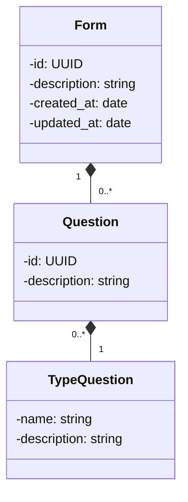

# dynamic-form-builder
### Class Diagram:

```mermaid
classDiagram
    Form "1" *-- "0..*" Question
    Question "0..*" *-- "1" TypeQuestion


    class Form{
        -id: UUID
        -description: string
        -created_at: date
        -updated_at: date
    }

    class Question{
        -id: UUID
        -description: string
    }

    class TypeQuestion{
        -name: string
        -description: string
    }
    
```
